## Concurency Model(in progress of planning)

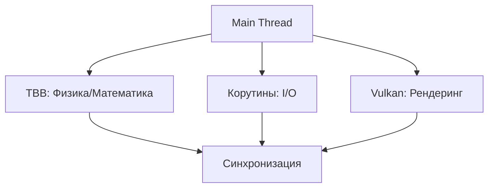

Vulkan resourses need to use mutex and lock_guard s

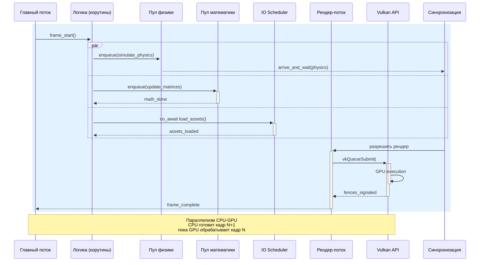


###  Архитектурная диаграмма
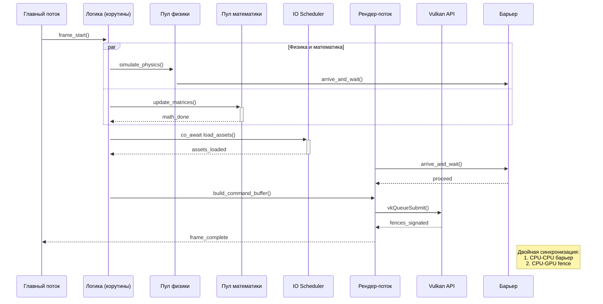


или 

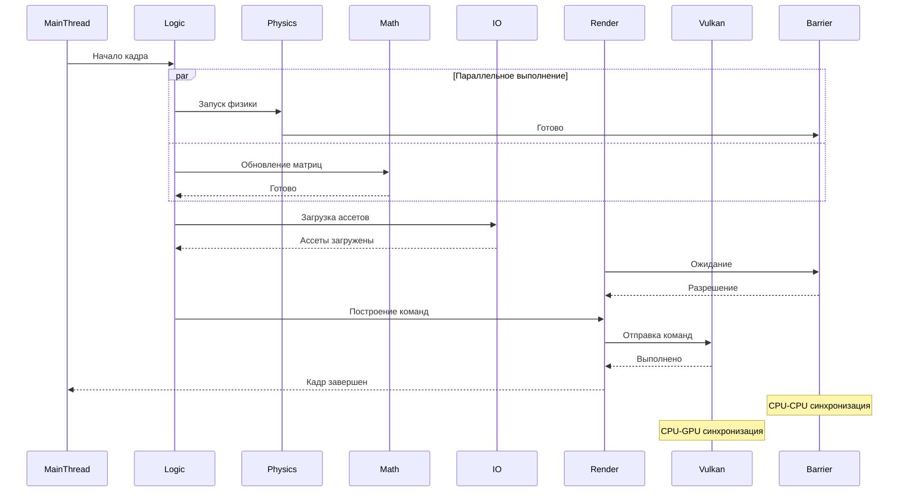

## Render поток
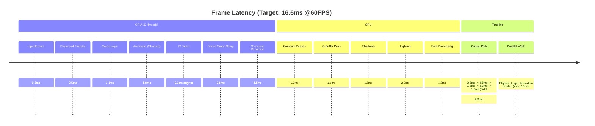
Псевдокод да в стиле C++ но верхне уровевый а не конкретная реализация
```


1. **PhysicsPool** (отдельный пул потоков):
```cpp
class PhysicsPool {
public:
    void simulate() {
        tbb::parallel_for(0, bodies.size(), [&](int i) {
            // SIMD-оптимизированные вычисления
            bodies[i].integrate(dt); 
        });
    }
};
```

2. **IOScheduler** (корутины + IO):
   Псевдокод да в стиле C++ но верхне уровевый а не конкретная реализация
```cpp
coro::task<Texture*> load_texture(string path) {
    auto data = co_await io_async_read(path);
    co_return parse_texture(data); // Парсинг в worker-потоке
}
```

3. **RenderThread-Vulkan связка**:
   Псевдокод да в стиле C++ но верхне уровевый а не конкретная реализация
```cpp
void render_thread_func() {
    while (running) {
        wait_for_main_thread_data();
        
        VkCommandBuffer cmd = begin_frame();
        update_uniforms(cmd);
        vkEndCommandBuffer(cmd);
        
        submit_to_vulkan(cmd);
    }
}
```

### Критические пути синхронизации:

1. **Physics → Render**: Vulkan fences + барьер только для CPU синхронизации
   Псевдокод да в стиле C++ но верхне уровевый а не конкретная реализация
```cpp
// Общий барьер для 2 участников (поток физики и рендер-поток)
inline std::barrier physics_render_sync{2};

// В потоке физики:
void physics_thread() {
    simulate_physics();
    physics_render_sync.arrive_and_wait(); // 1/2
}

// В рендер-потоке:
void render_thread() {
    physics_render_sync.arrive_and_wait(); // 2/2 - разблокирует оба
    build_command_buffer();
}
```

2. **IO → Main Thread**:
   Псевдокод да в стиле C++ но верхне уровевый а не конкретная реализация
```cpp
coro::task<void> asset_loading() {
    // Неблокирующее ожидание
    while (!io_completed) {
        co_await coro::suspend_always{};
    }
}
```

### Распределение потоков
| Пул             | Потоки | Размер очереди | Приоритет |
|-----------------|--------|----------------|-----------|
| Physics         | 2-4    | 8              | High      |
| Math            | 2      | 16             | Normal    |
| IO              | 1-2    | 32             | Low       |
| Render          | 1      | 1 (FIFO)       | Realtime  |


### Реализациия +-:

1. Для физики tbb scalable_allocator аллокатор и  tbb::enumerable_thread_specific

2. Для корутин-ожиданий  **таймауты**:
```cpp
co_await wait_with_timeout(physics_ready, 16ms);
```
и
```cpp
co_await resume_on(some_scheduler);
```

3. В рендер-потоке  **triple buffering**:
-  разделение обязанностей потоков

4.  **Double Buffering** для игрового состояния:
- Устранение contenation  между физикой и рендером
## Иерархия параллелизма

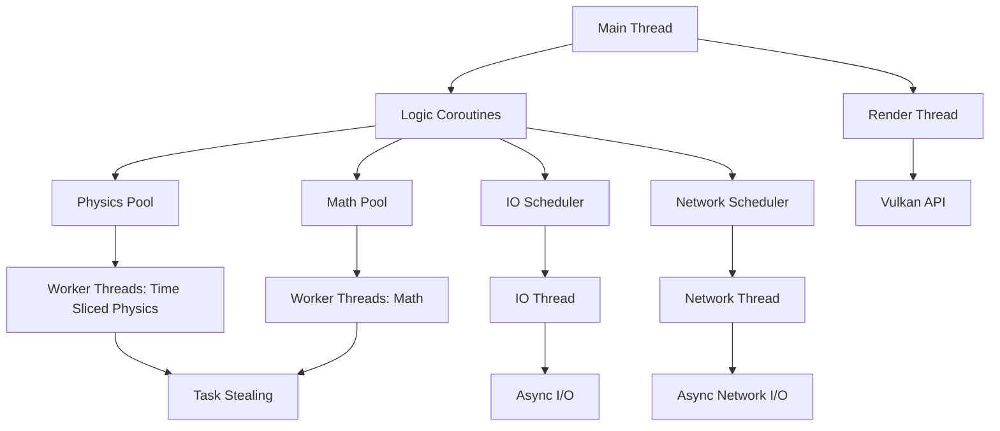

## Threading model(more details)
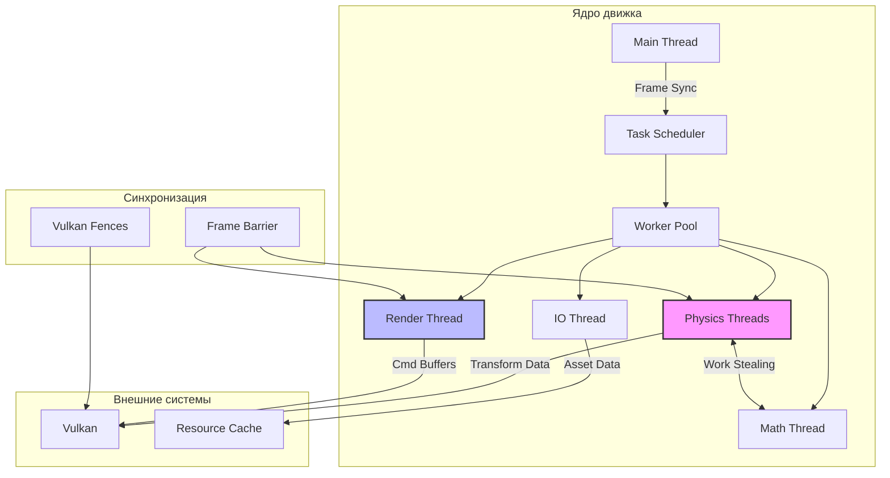

## Архитектура памяти (RAII based)

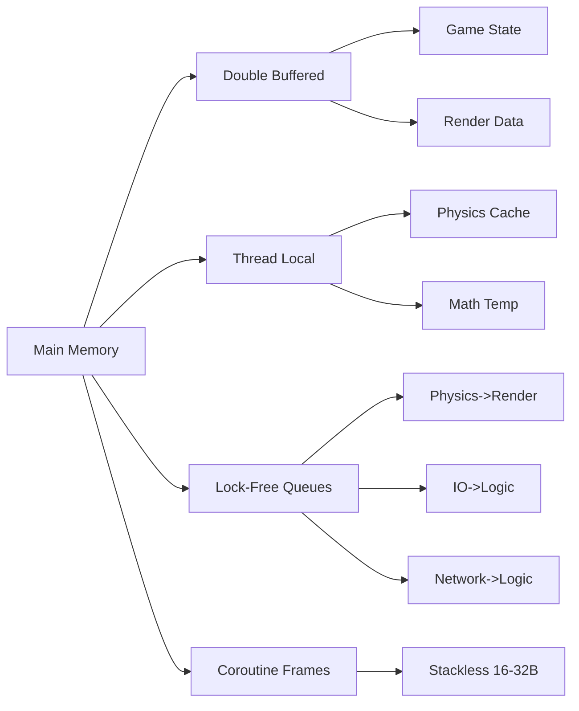

## Memory dependencies
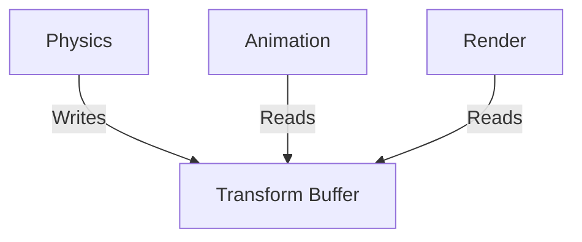
## Memory Pools
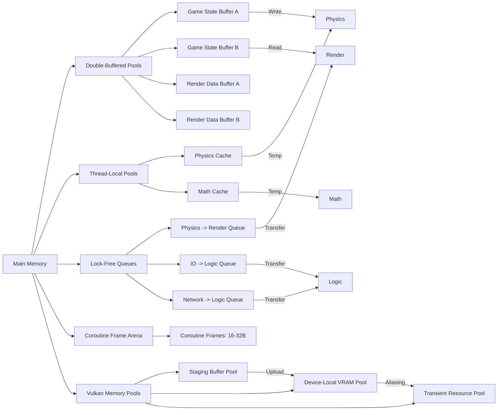

## Memory deps
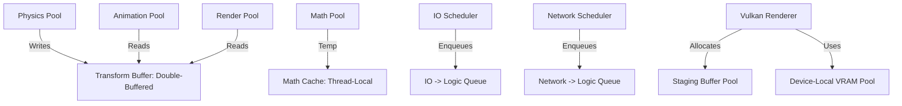

## Vulkan Integration
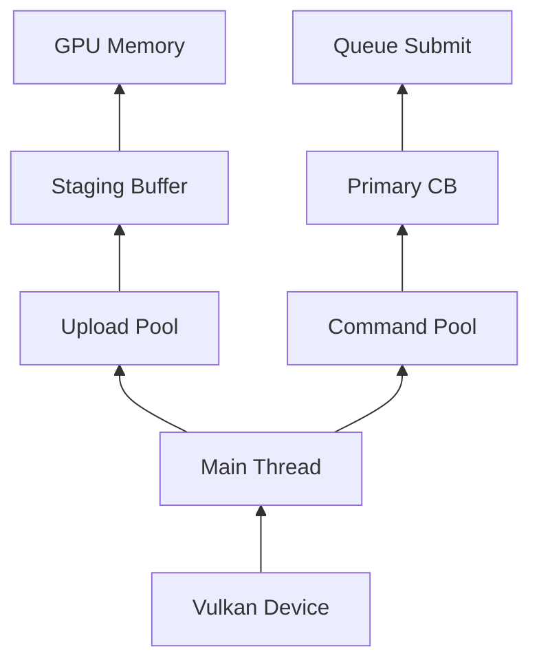

### Vulkan memory managment
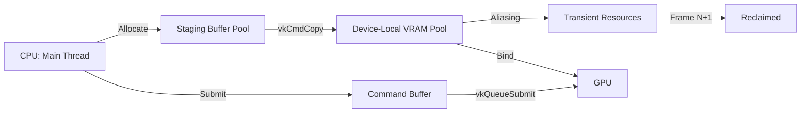
### Vulkan multi queue
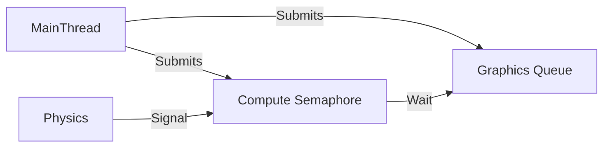

### Vulkan multithreading

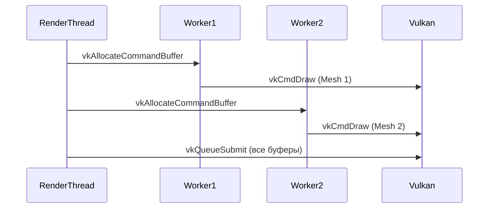

**One `VkQueue` for render thread** (but multiple buffers).
**`VK_COMMAND_POOL_CREATE_RESET_COMMAND_BUFFER_BIT`**
Sync with **`VkTimelineSemaphore`**

### Hot realod
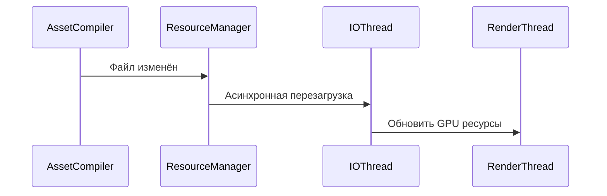

### Task graph
Create own based TBB on and inspired by [UE Task graph](https://github.com/EpicGames/UnrealEngine/blob/release/Engine/Source/Runtime/Core/Private/Async/TaskGraph.cpp) 
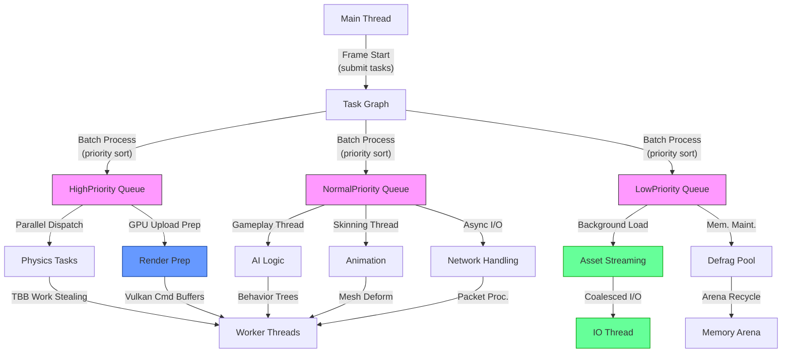


### Task Graph profiling
```cpp
struct TaskNode {
    tbb::task* task;
    std::chrono::microseconds avg_time;
    uint32_t dependencies;
};
```

Also need  **automatic LOD** for tasks 
## Frame run
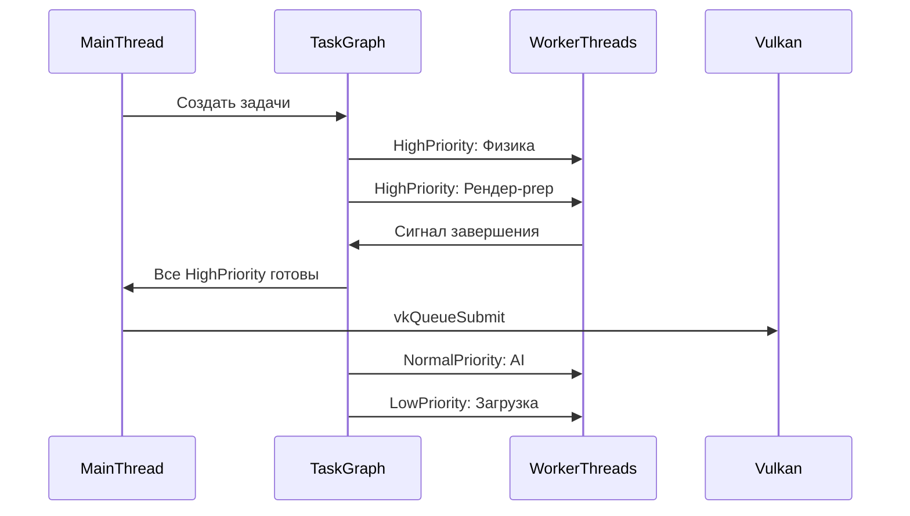

## Frame run with networking
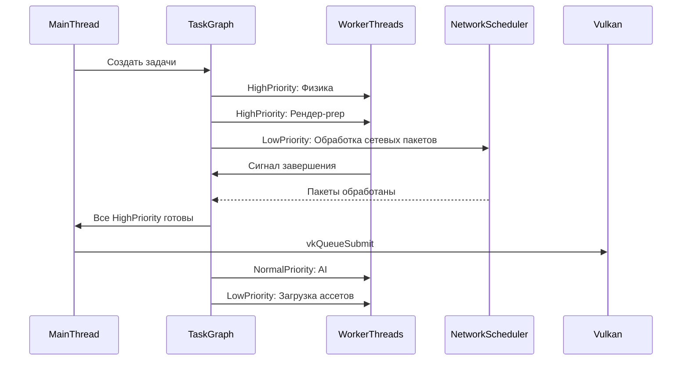


### Frame pacing
Control CPU-GPU drift via vkAcquireNextImageKHR + at render thread sleep_until(expected_frame_time)


## VERSIONS WITH BATCHING
### Parallelism hierarchy
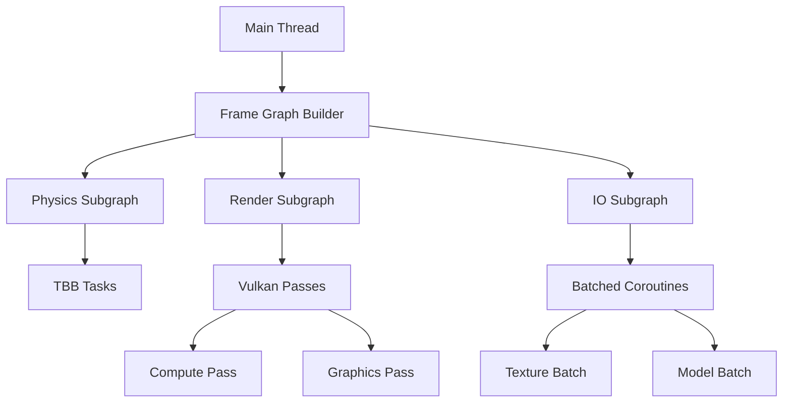

### Task Graph with bathcing
```mermaid
graph TD
    A[Main Thread] -->|Submit| B[Task Scheduler]
    B --> C[HighPriority]
    B --> D[NormalPriority]
    B --> E[LowPriority]
    C --> F["Physics (Batched TBB Tasks)"]
    D --> G["Render Prep (Frame Graph)"]
    E --> H["IO (Batched Coroutines)"]
    F --> I[Worker Threads]
    G --> J[Render Thread]
    H --> K[IO Thread]
```

### Frame Graph
```mermaid
sequenceDiagram
    participant MT as Main Thread
    participant FG as Frame Graph
    participant Phys as Physics
    participant Render as Render Thread
    participant IO as IO Scheduler

    MT->>FG: Build Frame Graph
    FG->>Phys: Add Physics Nodes (Batched)
    FG->>IO: Add IO Nodes (co_await batch)
    FG->>Render: Add Render Passes
    MT->>FG: Compile & Execute
    Phys->>FG: Complete
    IO->>FG: Complete
    Render->>FG: Submit GPU Work
    FG->>MT: Frame Done
```

### Memory Arch
```mermaid
graph LR
    A[GPU Memory] --> B[Frame Graph Resources]
    B --> C[Physics Data]
    B --> D[Render Targets]
    B --> E[Texture Array Batch]
    A --> F[Staging Buffers]
    F --> G[Batched Uploads]
```

## Single frame graph
```mermaid
sequenceDiagram
    participant MainThread as Главный поток
    participant TaskGraph as Граф задач
    participant Physics as Физика [CPU-Bound]
    participant Logic as Логика [CPU-Bound]
    participant Animation as Анимация [CPU-Bound]
    participant IO as IO задачи [IO-Bound]
    participant Network as Сеть задачи [IO-Bound]
    participant FrameGraph as Построение рендера [CPU-Bound]
    participant RenderThread as Рендер-поток [CPU-Bound → GPU Submit]
    participant Vulkan as Vulkan API
    participant GPU as GPU [GPU-Bound]

    MainThread->>MainThread: Сбор ввода / событий [CPU-Bound]
    MainThread->>TaskGraph: Начало кадра - создание задач [CPU-Bound]

    %% Параллельные задачи
    TaskGraph->>+Physics: Симуляция физики
    TaskGraph->>+Logic: Обновление логики игры
    TaskGraph->>+Animation: Обновление анимаций
    TaskGraph->>+IO: Стриминг ассетов / IO
    TaskGraph->>+Network: Получение и отправка сетевых сообщений

    %% Ожидание завершения
    Physics-->>-TaskGraph: Физика готова
    Logic-->>-TaskGraph: Логика готова
    Animation-->>-TaskGraph: Анимация готова
    IO-->>-TaskGraph: IO готово
    Network-->>-TaskGraph: Сеть готова

    TaskGraph->>FrameGraph: Построение рендер-проходов [CPU-Bound]
    FrameGraph->>RenderThread: Построение команд для GPU [CPU-Bound]
    RenderThread->>Vulkan: Отправка команд в GPU [CPU→GPU]
    Vulkan->>GPU: Выполнение команд [GPU-Bound]

    %% Параллельность CPU и GPU
    Note over MainThread IO Networkgin: CPU начинает подготовку следующего кадра параллельно с GPU работой + принимает сетевые сообщения

    GPU-->>RenderThread: Сигнал о завершении GPU работы
    RenderThread->>MainThread: Завершение кадра (present swapchain)


```

## Latency Graph(~)
 Use VK_EXT_extended_dynamic_state(3) for less draw calls
```mermaid
timeline
    title Frame Latency (Target: 16.6ms @60FPS)
    section CPU (12 threads)
    Input/Events       : 0.5ms
    Physics (4 threads): 2.5ms 
    Game Logic         : 1.2ms
    Animation (Skinning): 1.8ms
    IO Tasks          : 0.3ms (async)
    Frame Graph Setup  : 0.8ms
    Command Recording : 1.5ms
    section GPU
    Compute Passes    : 1.2ms
    G-Buffer Pass     : 1.0ms
    Shadows           : 1.5ms
    Lighting          : 2.0ms
    Post-Processing   : 1.8ms
    section Timeline
    Critical Path     : 0.5ms -> 2.5ms -> 1.5ms -> 2.0ms -> 1.8ms (Total: 8.3ms)
    Parallel Work     : Physics+Logic+Animation overlap (max 2.5ms)
```
```mermaid
timeline
    title Оптимизированный Timeline кадра (target: 16.6ms @60Hz)
    section CPU
    Physics (4 threads) : 0ms : 2ms
    Math (2 threads) : 1ms : 1.5ms
    IO (coroutines) : 0.5ms : 3ms
    Render Prep : 2ms : 1ms
    section GPU
    Graphics Queue : 2.5ms : 3.2ms
    Compute Queue : 1ms : 2ms
    section Синхронизация
    CPU Barrier : 2ms : 0.1ms
    GPU Fence : 5.5ms : 0.1ms
```

## Network
```mermaid
graph TD
    A[Game Loop] --> B[Network Manager]
    B --> C[Send Queue]
    B --> D[Receive Queue]
    C --> E[IO Service Pool]
    D --> F[Message Dispatcher]
    E --> G[WinSock/IOCP]
    E --> H[ASIO]
    F --> I[Game Systems]
    G -->|Event| F
    H -->|Event| F
    I --> J[Input snapshots]
```

IOCP with coroutines
```mermaid
classDiagram
    class NetworkService {
        +HANDLE iocp
        +vector<thread> workers
        +start()
        +stop()
    }
    
    class SocketConnection {
        +SOCKET socket
        +coroutine send(buffer)
        +coroutine receive()
    }
    
    NetworkService "1" *-- "n" SocketConnection
```

CoroErrorHandling:
Cancel task if error via std::stop_token

### Cross thread communication
**moodycamel::ConcurrentQueue**