## Engine

Currently at arch stage and come implementations(can be changed)

### Concurency model
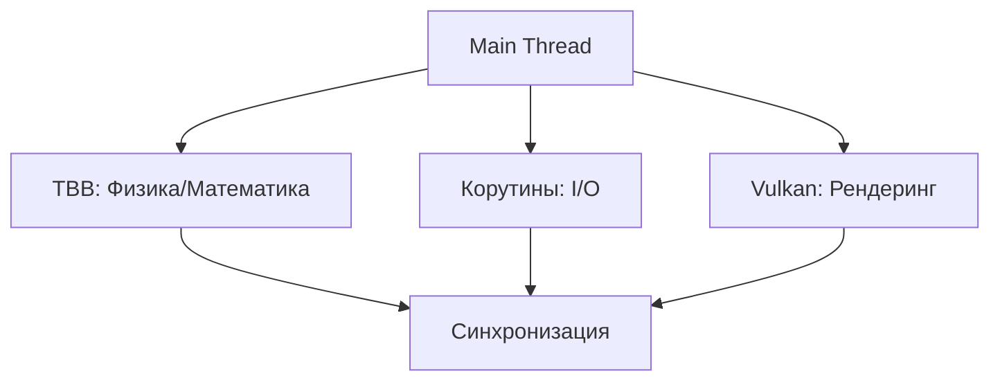

Vulkan resourses need to use mutex and lock_guard s

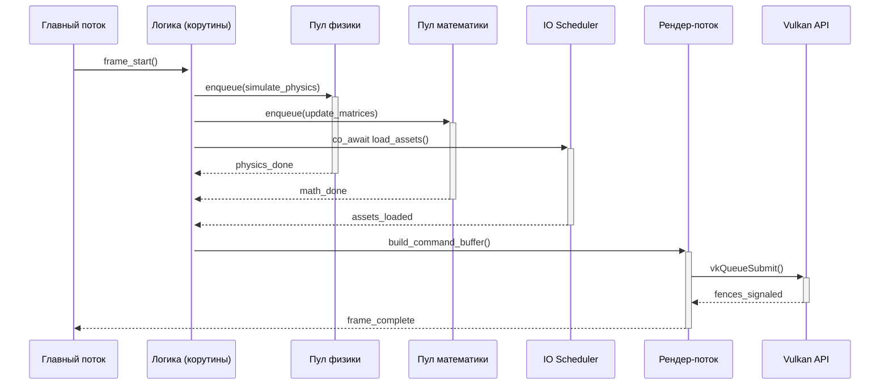


###  Архитектурная диаграмма
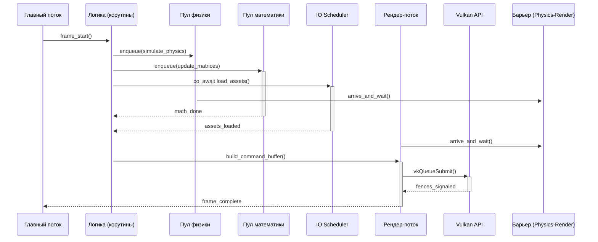


## Render поток
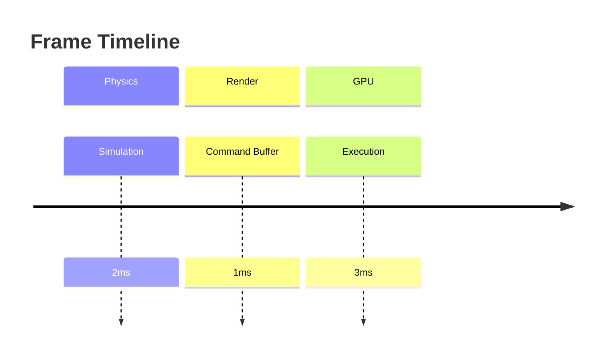


### Распределение потоков
| Пул             | Потоки | Размер очереди | Приоритет |
|-----------------|--------|----------------|-----------|
| Physics         | 2-4    | 8              | High      |
| Math            | 2      | 16             | Normal    |
| IO              | 1-2    | 32             | Low       |
| Render          | 1      | 1 (FIFO)       | Realtime  |


### Реализациия +-:

1. Для физики tbb scalable_allocator аллокатор:

2. Для корутин-ожиданий  **таймауты**:

3. В рендер-потоке  **triple buffering**:
-  разделение обязанностей потоков

4.  **Double Buffering** для игрового состояния:
- Устранение contenation  между физикой и рендером
## Иерархия параллелизма

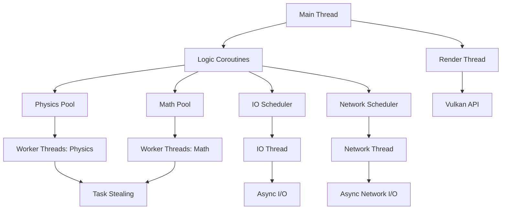

## Архитектура памяти (RAII based)

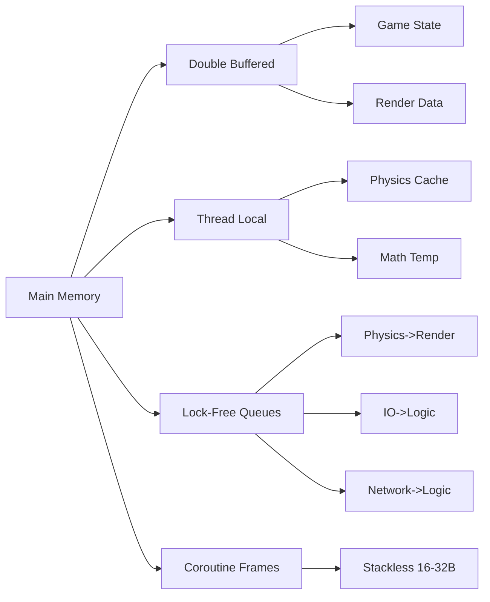

## Memory dependencies
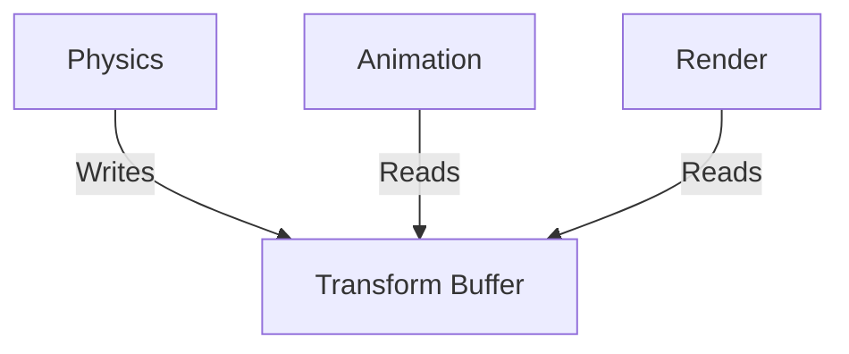
## Vulkan Integration
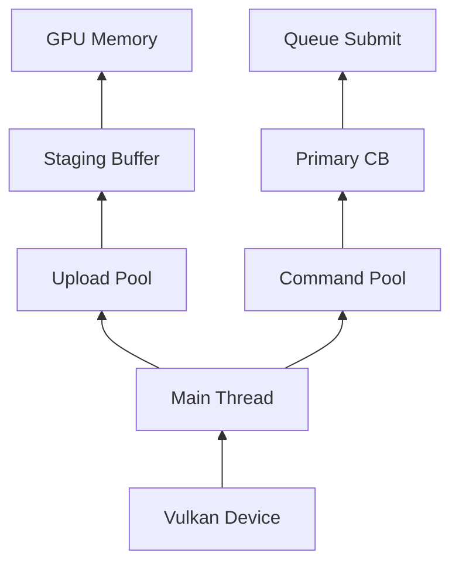

### Vulkan memory managment
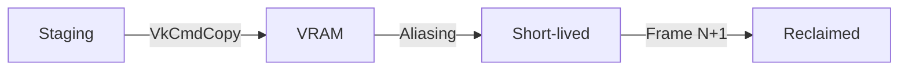
### Vulkan multi queue
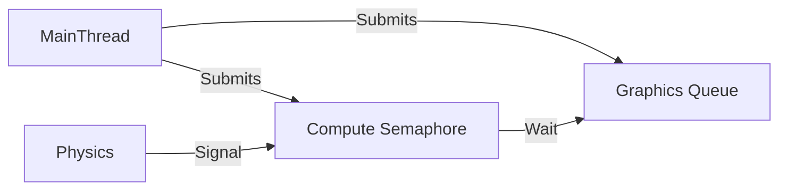

### Task graph
Create own based TBB on and inspired by [UE Task graph](https://github.com/EpicGames/UnrealEngine/blob/release/Engine/Source/Runtime/Core/Private/Async/TaskGraph.cpp) 
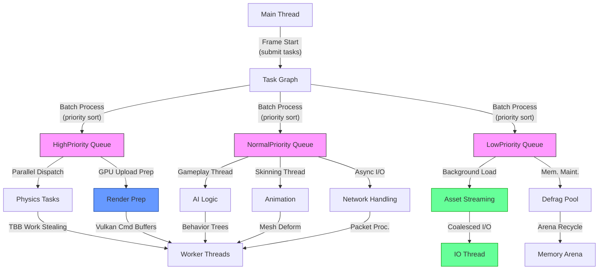


### Task Graph profiling
```cpp
struct TaskNode {
    tbb::task* task;
    std::chrono::microseconds avg_time;
    uint32_t dependencies;
};
```

Also need  **automatic LOD** for tasks 
## Frame run
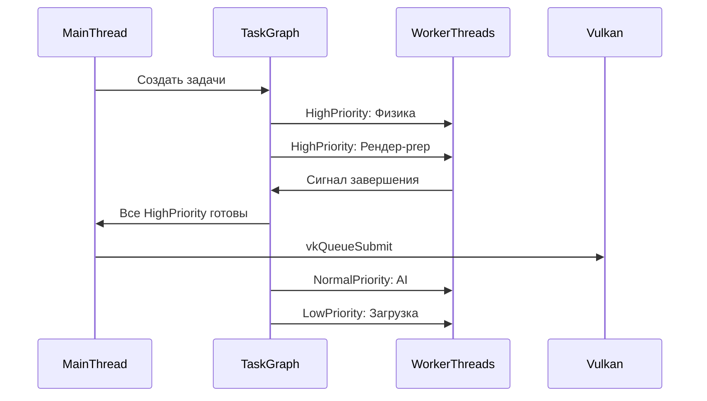

## Frame run with networking
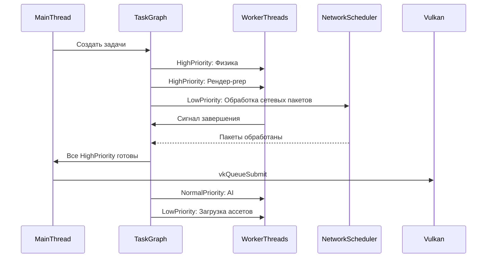


### Frame pacing
Control CPU-GPU drift via vkAcquireNextImageKHR + at render thread sleep_until(expected_frame_time)


## VERSIONS WITH BATCHING
### Parallelism hierarchy
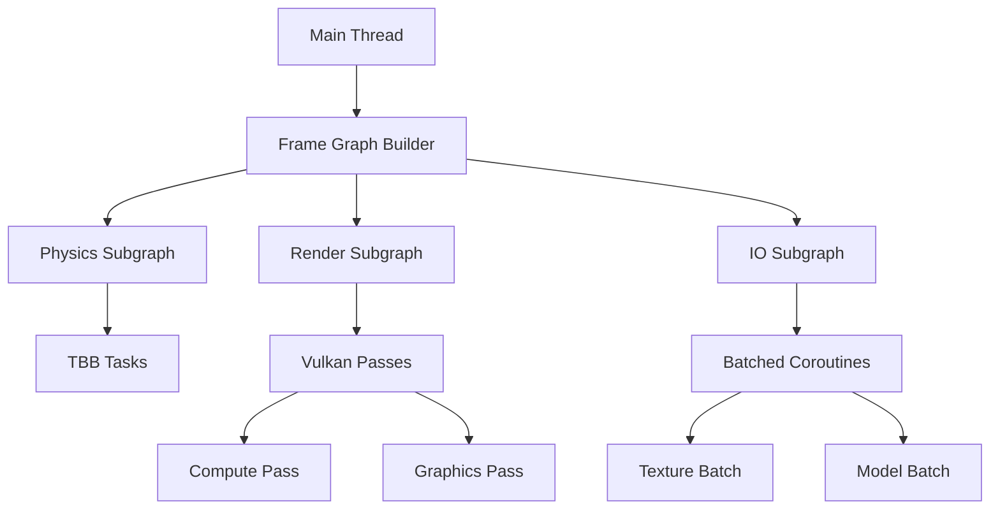

### Task Graph with bathcing
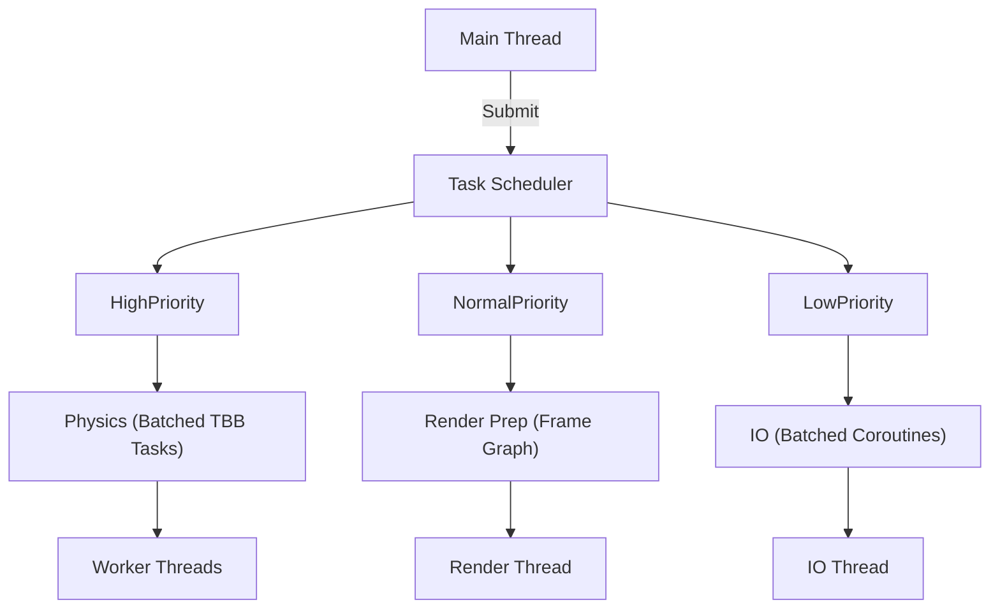

### Frame Graph
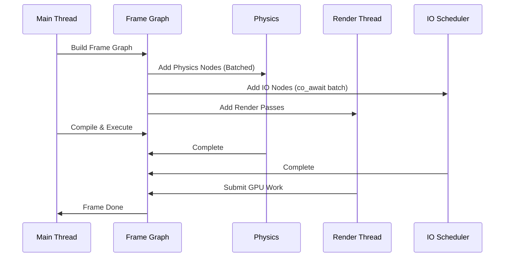

### Memory Arch
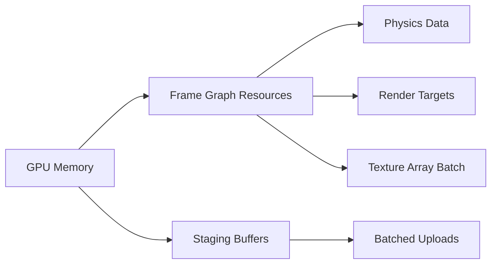

## Single frame graph
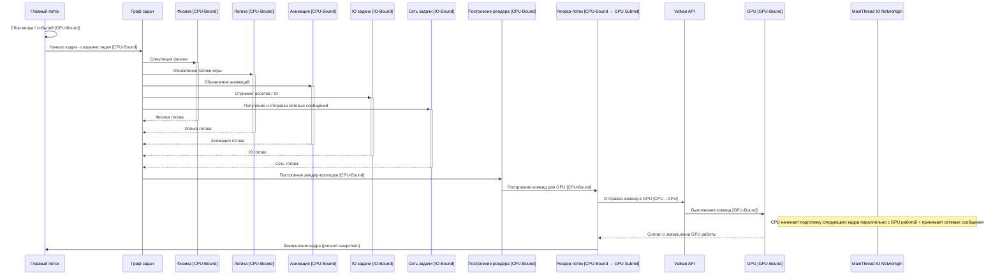

## Latency Graph(~)
 Use VK_EXT_extended_dynamic_state(3) for less draw calls
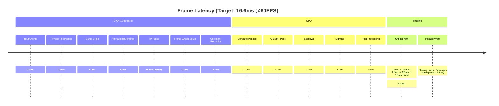
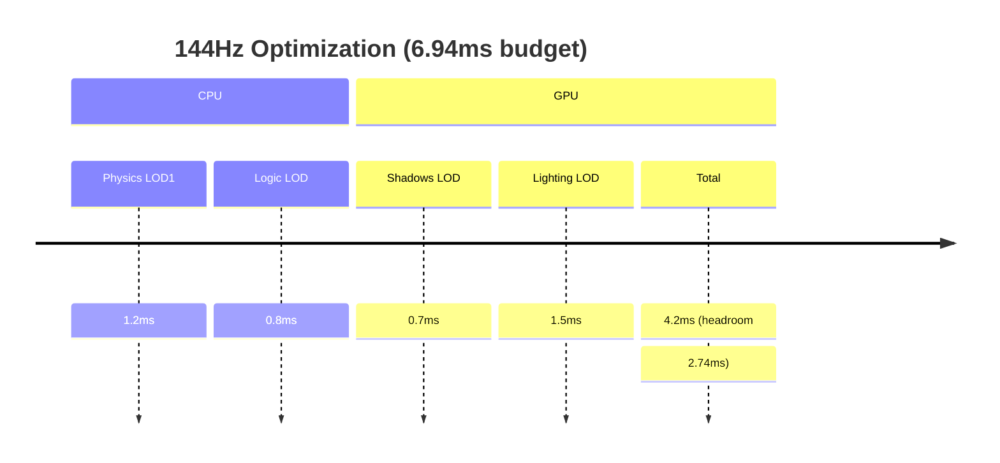

## Network
```mermaid
graph TD
    A[Game Loop] --> B[Network Manager]
    B --> C[Send Queue]
    B --> D[Receive Queue]
    C --> E[IO Service Pool]
    D --> F[Message Dispatcher]
    E --> G[WinSock/IOCP]
    E --> H[ASIO]
    F --> I[Game Systems]
    G -->|Event| F
    H -->|Event| F
```

IOCP with coroutines
```mermaid
classDiagram
    class NetworkService {
        +HANDLE iocp
        +vector<thread> workers
        +start()
        +stop()
    }
    
    class SocketConnection {
        +SOCKET socket
        +coroutine send(buffer)
        +coroutine receive()
    }
    
    NetworkService "1" *-- "n" SocketConnection
```

CoroErrorHandling:
Cancel task if error via std::stop_token

### Cross thread communication
**moodycamel::ConcurrentQueue**

### Build Debug

```sh
mkdir -p build/debug
cd build/debug
cmake --preset debug
cmake --build --preset build-debug
```

### Build Release:
```sh
mkdir -p build/release
cd build/release
cmake --preset release
cmake --build --preset build-release
```

### Vcpkg debug build:
```sh
cmake --preset vcpkg-debug
cmake --build --preset build-vcpkg-debug
```

### Vcpkg release  build:
```sh
cmake --preset vcpkg-release
cmake --build --preset build-vcpkg-release
```


### Build with sanitazers:

## Address sanitizer
```sh
cmake --preset debug-sanitize-address
cmake --build --preset build-debug-sanitize-address
```
## Thread sanitizer
```sh
cmake --preset debug-sanitize-thread
cmake --build --preset build-debug-sanitize-thread
```
## Undefined behavior sanitizer
```sh
cmake --preset debug-sanitize-undefined
cmake --build --preset build-debug-sanitize-undefined```
```
(specify sanitizer what you need)

### Testing

## Run all tests (release build)
```sh
ctest --preset test-all
```

## Run tests with address sanitizer
```sh
ctest --preset test-sanitize-address
```

## Run specific test suite
```sh
ctest --preset test-library1
```

## Run docs generation
```sh
cmake --build . --target docs
```