### Server

Деплой в K8s

| Компонент    | Userver(C++ HTTP)/Actix(Rust ws)      | ASIO with io_uring/yojimbo            | In Game Auth       |     |
| ------------ | ------------------------------------- | ------------------------------------- | ------------------ | --- |
| **Логика**   | Аутентификация, чат, API, матчмейкинг | Игровой стейт, физика, предсказание   | Check token via ws |     |
| **Протокол** | HTTP/WebSocket (TCP)                  | UDP (yojimbo) + TCP (ASIO + io_uring) | WebSockets         |     |
| **Сеть**     | Высокоуровневые RPC-запросы           | Low-latency пакеты                    | Low-Latency        |     |
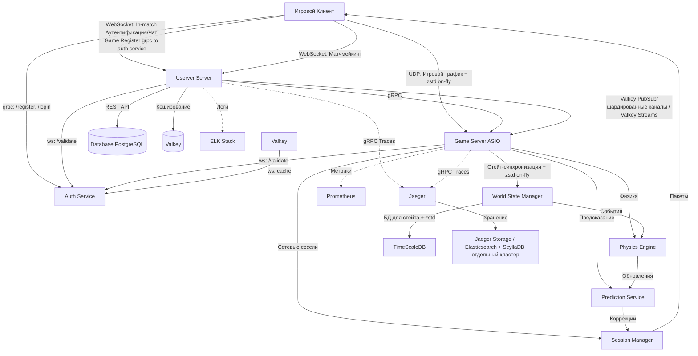


- **Userver** обрабатывает:
    - Регистрацию/логин (`ws/auth/login`), (`grpc/auth/login`).
    - Создание лобби (`ws/match/create`).
    - Чат через WebSocket.
    - GeoDNS
- **ASIO(with io_uring)/yojimbo**:
    - Принимает UDP-пакеты с инпутами игроков.
    - Рассчитывает физику и отправляет стейт.
 *  **Actix(Rust)** 
	  * Auth Service for validation
### ** Сессии**
Session {
    player_id: UUID
    connection_id: int (или token для UDP)
    last_input_time: timestamp
    last_known_state: WorldStateSnapshot
    reconnection_token: UUID (отдается клиенту при подключении)
    is_active: bool
}
- При первом подключении сервер выдает `reconnection_token` игроку.
- Если игрок дропнулся (разрыв TCP/UDP), сервер НЕ удаляет его сессию сразу.
    - Помечает как `is_active = false`.
    - Ставит таймер `reconnect_timeout` (например, 30 секунд).
- Клиент при повторном запуске отправляет `reconnection_token` через HTTP или WebSocket.
- Сервер восстанавливает сессию:
    - Ставит `is_active = true`.
    - Обновляет `connection_id/адрес`.
    - Отправляет клиенту актуальное состояние мира (`last_known_state`) и дельты.
- Хранить `reconnection_token` в сессии + Valkey.
* Lru cache для  для частых запросов
- Понимать, что UDP-порт клиента при реконнекте может быть новым.
    
- Ловить **KeepAlive/Heartbeats** от клиента (если нет heartbeat долго, считаем дисконнектом).


### **Интеграция между серверами**
gRPC


Client - Server model

Auth
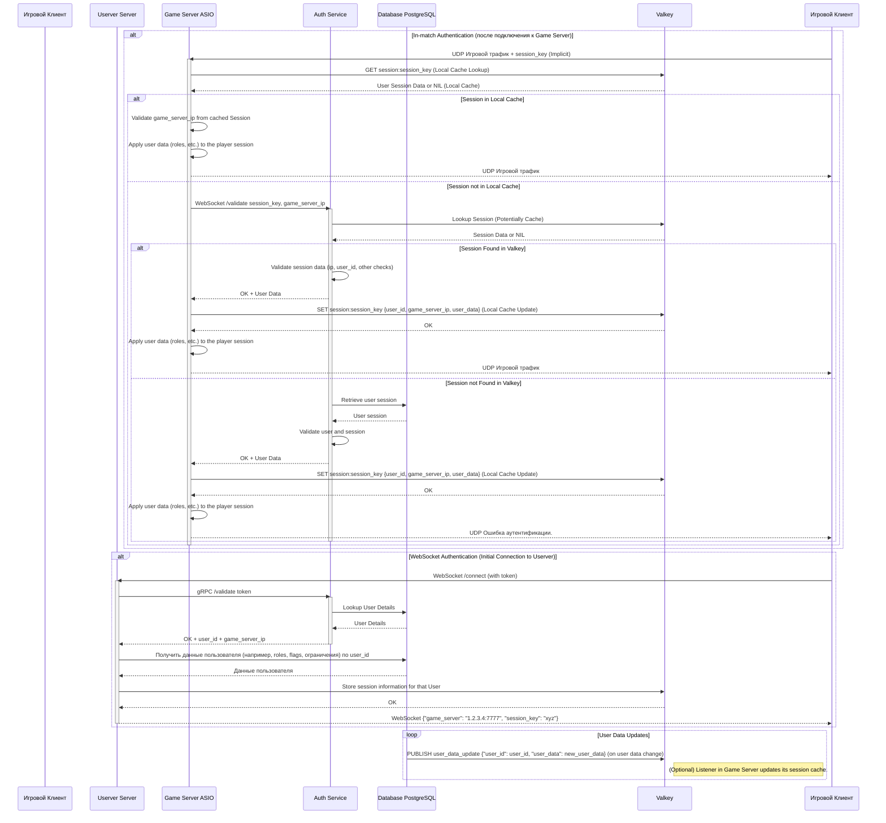


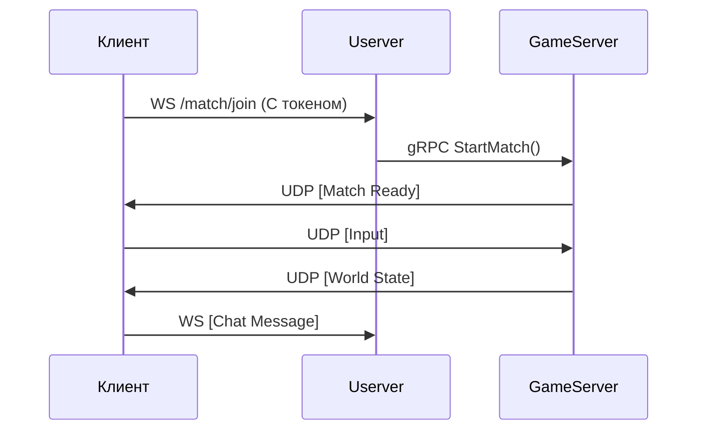

### Scaling
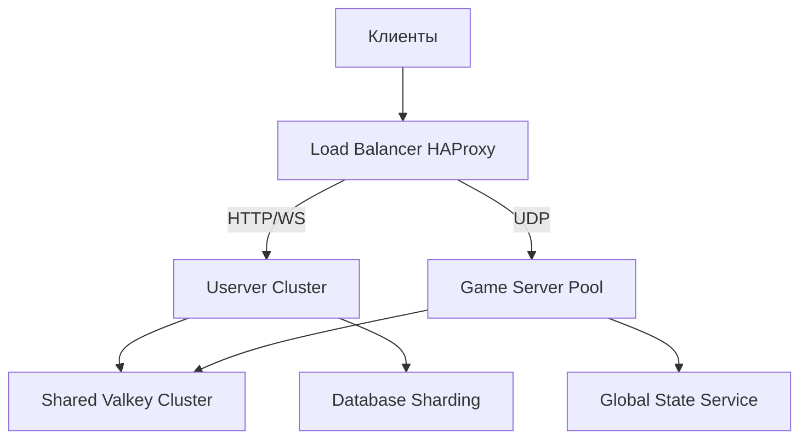

### Reconnect logic
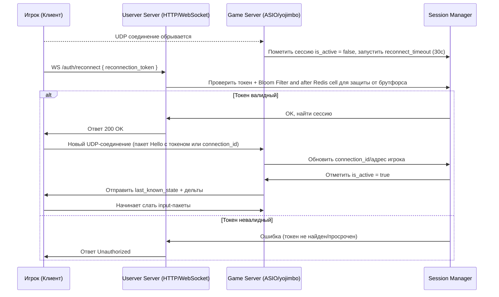

### Reconnect timeout
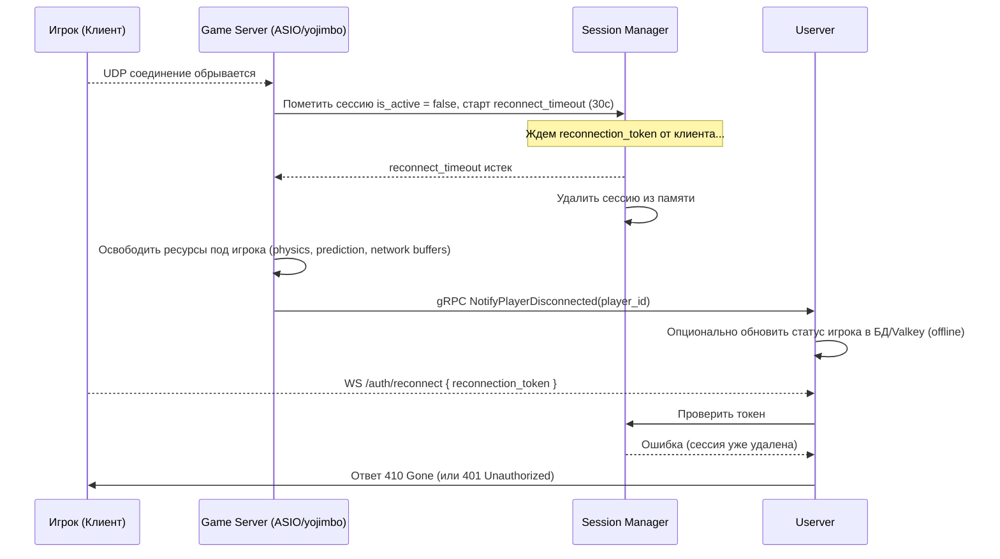

### Auth Server

---

### **Архитектура Auth Service**
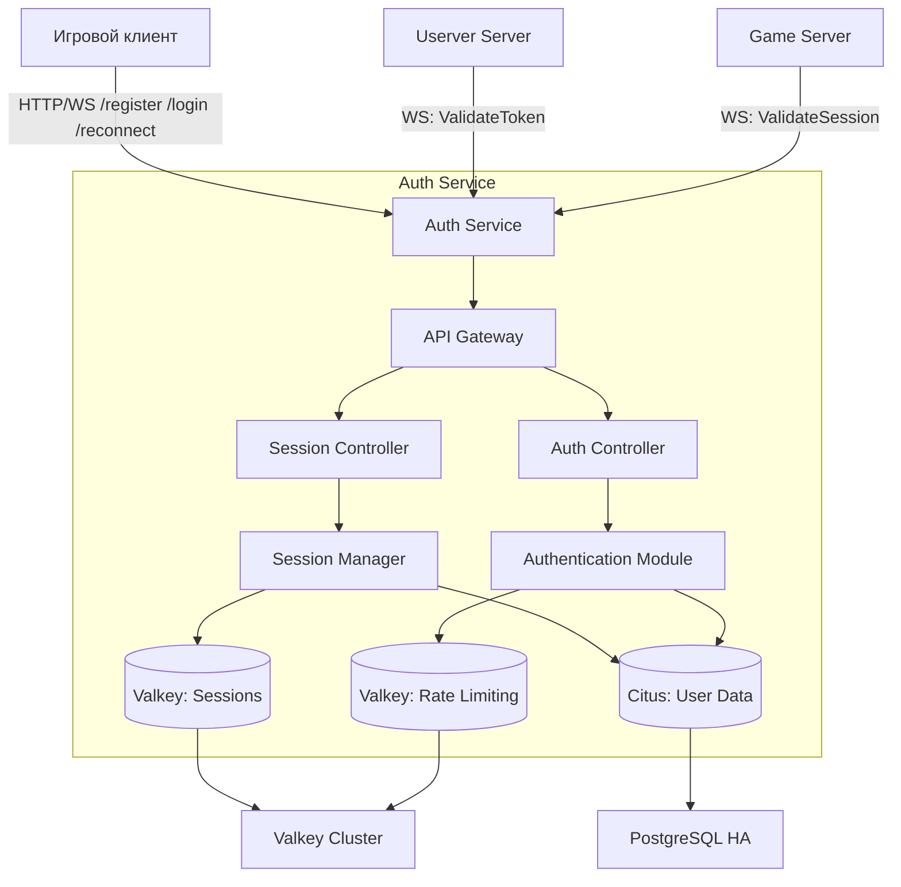

---

### **Компоненты и их ответственность**

#### 1. **API Gateway**
- **Роль**: Единая точка входа для всех запросов.
- **Функции**:
  - Маршрутизация (`/register`, `/login`, `/reconnect`).
  - TLS termination.
  - Базовая валидация запросов (JSON schema, параметры).

#### 2. **Auth Controller**
- **Эндпоинты**:
  - `POST /register` – Регистрация (логин/пароль, OAuth, deviceId).
  - `POST /login` – Аутентификация (возврат JWT + refresh token).
  - `POST /logout` – Инвалидация сессии.
- **Интеграции**:
  - Проверка капчи (если нужно).
  - Верификация email/SMS через внешние сервисы (например, Twilio).
* **Кеширование**: 
  - in-memory LRU cache с TTL 1-5 сек. + Valkey

#### 3. **Session Controller**
- **Эндпоинты**:
  - `POST /reconnect` – Восстановление сессии (через `reconnection_token`).
  - `WS /validate` – Валидация токена в реальном времени (для игровых серверов).
- **Генерация токенов**:
  - **Access Token**: JWT с TTL 5 мин (для WS/gRPC) +  OAuth 2.0 Token Binding.
  - **Refresh Token**: TTL 7 дней (хранится в Valkey).
  - **Reconnection Token**: UUIDv4 + TTL 30 сек (только для UDP-сессий).

#### 4. **Authentication Module**
- **Методы аутентификации**:
  - Логин/пароль (bcrypt/scrypt).
  - OAuth 2.0 (Google, Steam, Xbox Live).
  - DeviceID (для мобильных устройств).
- **Защита**:
  - Rate limiting (Redis Cell).
  - Учет неудачных попыток (блокировка после 5 попыток).

#### 5. **Session Manager**
- **Хранение данных**:
  - **Valkey**:
    - Сессии: `session:<token>` → `{player_id, ip, device, expires_at}`.
    - Индексы: `user:<id>:sessions` → Set[token].
  - **PostgreSQL**:
    - Таблица `users`: `id, email, password_hash, 2fa_secret`.
    - Таблица `devices`: `user_id, device_id, last_login`.
- **Методы**:
  - `CreateSession()` – Генерация токенов, запись в Valkey.
  - `ValidateToken()` – Проверка JWT подписи + актуальности в Valkey.
  - `InvalidateSession()` – Удаление из Valkey (при logout).

---

### **Требования к безопасности**
1. **Шифрование**:
   - Все данные в PostgreSQL(Citus): поля `email`, `device_id` – зашифрованы (AES-GCM).
   - Пароли: хешируются scrypt (N=16384, r=8, p=1).
2. **Токены**:
   - JWT подписываются Ed25519 (асимметричная подпись).
   - Refresh токены – одноразовые (использование инвалидирует предыдущий).
3. **Защита от атак**:
   - **Brute Force**: Rate limiting + блокировка IP через Valkey.
   - **Replay Attacks**: Nonce в JWT (проверка через Valkey).
   - **MITM**: HSTS + Certificate Pinning на клиенте.
4. **Секреты**:
   - Ключи шифрования/подписи хранятся в Vault (или K8s Secrets).
   - Ротация ключей каждые 90 дней.

---

### **Интеграция с другими сервисами**
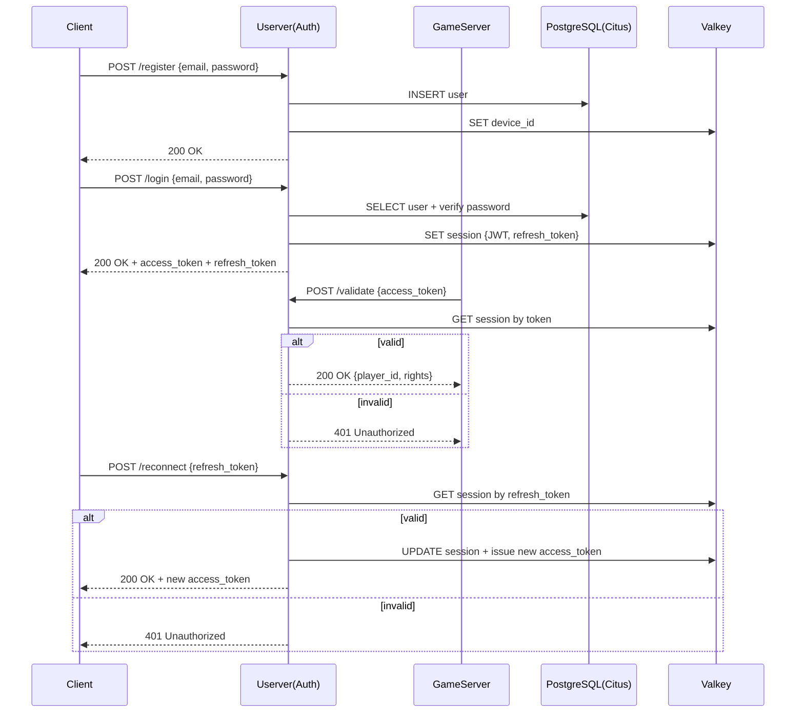

---

### **Масштабируемость**
1. **Горизонтальное масштабирование**:
   - Auth Service: 3+ реплики за балансировщиком.
   - Valkey: Cluster из 6 нод (3 master, 3 replica).
   - PostgreSQL(Citus): Чтение через реплики, запись в master.
1. **Шардирование**:
   - Сессии в Valkey шардируются по `player_id`.
   - Пользователи в PostgreSQL(Citus) – по `email_hash`.
1. **Кеширование**:
   - Частые запросы к `ValidateToken` кешируются в локальной памяти (TTL 1 сек).

---

### **Мониторинг**
1. **Метрики**:
   - `auth_login_attempts` (success/failure).
   - `session_reconnect_time_ms`.
   - `token_validation_latency`.
2. **Логи**:
   - Все попытки входа (с IP/deviceId).
   - Подозрительные события (смена устройства/IP при активной сессии).
3. **Трассировка**:
   - Распределенные трейсы через Jaeger (запросы между Userver ↔ Auth ↔ GameServer).

---

### **Резервное копирование**
1. **PostgreSQL(Citus)**:
   - Ежедневные снепшоты + WAL-логи.
   - Реплика в другом датацентре.
1. **Valkey**:
   - RDB + AOF (append-only file).
   - Копии сессий в S3 каждые 5 минут.

---

###   **Auth server реализация**
- **Язык**: Rust 
- **Библиотеки**:
 - Actix 
  - JWT: `jsonwebtoken` (Rust) / 
  - Valkey: `redis-rs` 
  - gRPC: `tonic` (Rust)
  - LRU cache: `lrumap` (Rust)
- **Инфраструктура**:
  - Развертывание: Kubernetes (StatefulSet для PostgreSQL, Deployment для остального).
  - Ingress: Nginx с TLS 1.3.


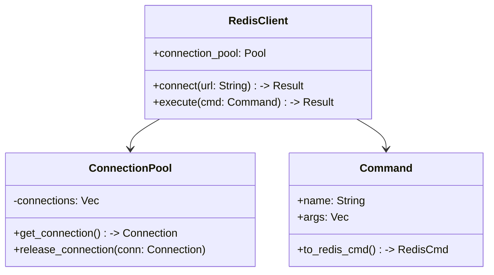

---


### Concurency  Model
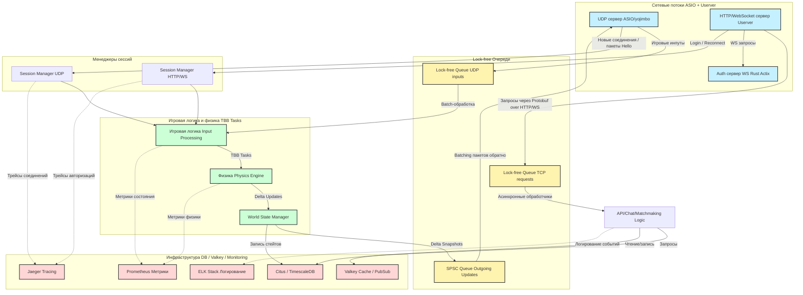

Реплицирование
 - userver:
      replicas: 3
  - game-server:
      replicas: 5 (от 2-10 HPA)
  - Valkey-cluster:
      replicas: 6 (3 masters + 3 replicas)
  - postgres:
      replicas: 2 (master + replica)
  - haproxy:
      replicas: 2
  - jaeger:
      replicas: 1 (agent per node)
  - elk-stack:
      logstash: 1
      elasticsearch: 1
      kibana: 1
  - prometheus:
      replicas: 1
  - grafana:
      replicas: 1
  - global-state-service:
      replicas: 2
  Репликация состояния
  - Репликация стейта через **CRDT** (Conflict-Free Replicated Data Types) или **временные снимки в TimescaleDB**.
- Использовать **Kubernetes StatefulSet** для игровых серверов с persistent volume.

## **HA и АвтоScaling**
- **Userver**:  
    Horizontal Pod Autoscaler (HPA) по метрике WebSocket connections или CPU.
- **Game Server Pool**:  
    Автоскейлинг по количеству активных матчей (через custom metrics API).
- **Auth Service**:  
    HPA по latency запросов на валидацию.
- **Valkey/Citus**:  
    Минимум 3 реплики + репликация + Sentinel/Patroni.

## Namespaces
```yaml
apiVersion: v1
kind: Namespace
metadata:
  name: game-backend

```

## Сервисы
| Сервис               | Тип                                 | Примечания                              |
| -------------------- | ----------------------------------- | --------------------------------------- |
| Userver Cluster      | Deployment + Service                | HTTP(S)/WS вход в систему и матчмейкинг |
| Game Server Pool     | Deployment + Service (UDP Headless) | Yojimbo, чистые UDP-сессии              |
| Auth Service (Actix) | Deployment + Service                | Проверка токенов, генерация токенов     |
| Valkey Cluster       | StatefulSet + Headless Service      | Для сессий, кешей                       |
| Citus Cluster        | StatefulSet + LoadBalancer Service  | Хранение профилей, пользователей        |
| HAProxy Ingress      | Deployment + LoadBalancer Service   | Для HTTP/WS (Ingress Gateway)           |
| Prometheus, Grafana  | Helm Charts                         | Метрики, алерты                         |
| Jaeger               | Deployment + Service                | Трейсинг gRPC и WS запросов             |
## Типы сервисов
- **Userver** — `ClusterIP` (внутренний балансировщик).
- **Game Servers** — `Headless Service` для прямого доступа по Pod IP.
- **Auth** — `ClusterIP` (Userver и Game-сервера будут обращаться к нему).
- **HAProxy** — `LoadBalancer`.
- **Valkey и Citus** — `StatefulSet` с PV/PVC для хранения данных.

## **Шардирование**

- **Valkey** — Через Valkey Cluster mode.
- **PostgreSQL** — Citus + PgBouncer.

1. GitHub Actions / GitLab CI:
	- Билд Docker-образов `userver`, `auth-service`, `game-server`.
	- Пуш в Docker Registry (например, ghcr.io, AWS ECR).
	
2. Helm Charts для каждого компонента:
    - `userver/`
    - `auth-service/`
    - `game-server/`
    - общие чарты (`Valkey`, `postgres`, `haproxy`, `prometheus`, `jaeger`).

## **Secrets Management**
- Все секреты (JWT keys, DB пароль) — в Kubernetes Secrets + Vault

### Сеть в k8s
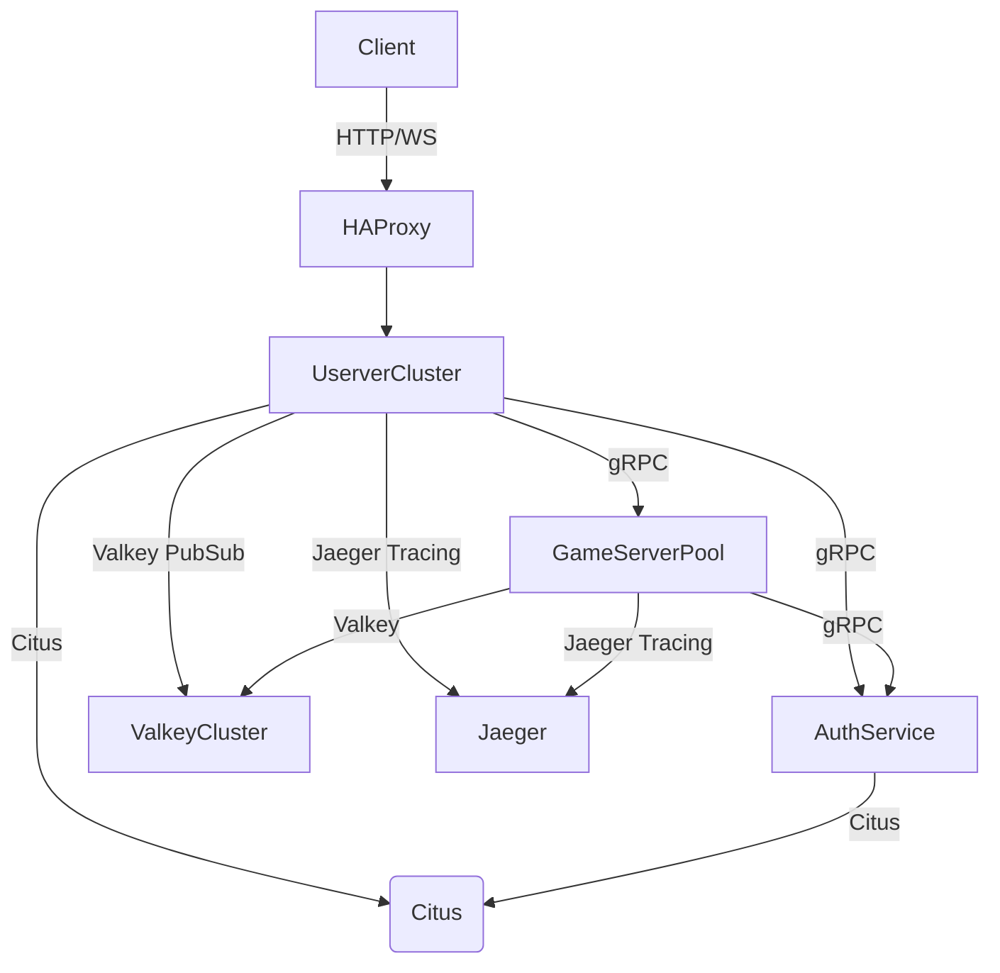

